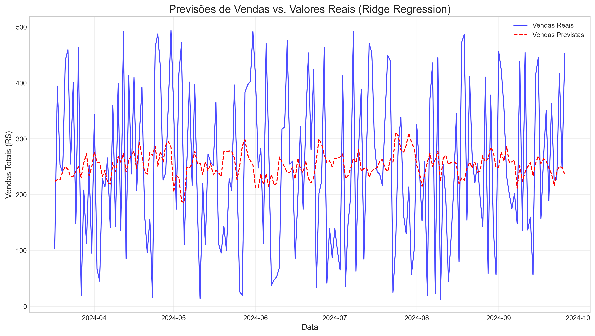

# Análise Preditiva com Scikit-Learn

## Sobre o Projeto
Este projeto implementa um modelo de análise preditiva para prever vendas futuras e identificar fatores que influenciam o desempenho de produtos em um e-commerce, utilizando técnicas de machine learning com scikit-learn.

## Principais Recursos
- Preparação e engenharia de features para machine learning
- Implementação de múltiplos algoritmos preditivos
- Avaliação e comparação de desempenho de modelos
- Interpretação de resultados e insights de negócio
- Modelo de previsão de vendas pronto para uso

## Estrutura do Projeto
- `notebooks/`: Jupyter notebooks com análise preditiva detalhada
- `data/`: Dados brutos, processados e modelos salvos
- `src/`: Scripts Python para modelagem e avaliação
- `reports/`: Relatórios e visualizações dos resultados

## Como Executar
1. Clone este repositório
2. Instale as dependências: `pip install -r requirements.txt`
3. Execute os notebooks na ordem numérica

## Tecnologias Utilizadas
- Python 3.9
- pandas 1.5.3
- numpy 1.24.3
- scikit-learn 1.2.2
- matplotlib 3.7.1
- seaborn 0.12.2

## Dados
Os dados utilizados são do [Brazilian E-Commerce Public Dataset by Olist](https://www.kaggle.com/datasets/olistbr/brazilian-ecommerce), disponibilizados no Kaggle.

## Autor
Douglas Rodrigues - [LinkedIn](https://linkedin.com/in/douglas-rodrigues-da-silva-30a018222)
